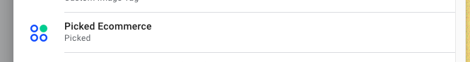
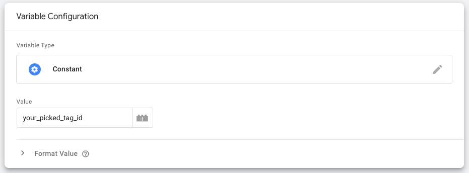
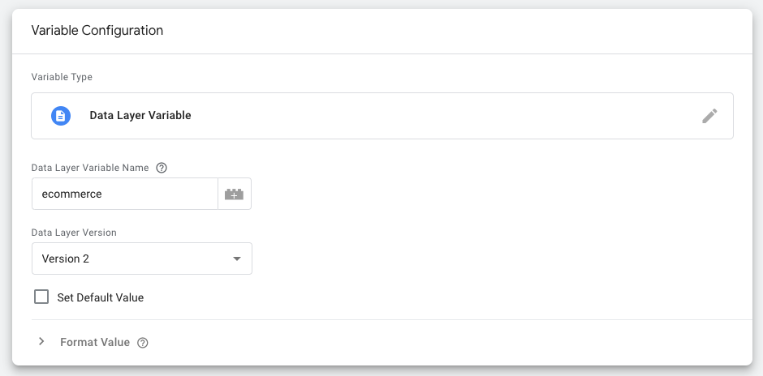
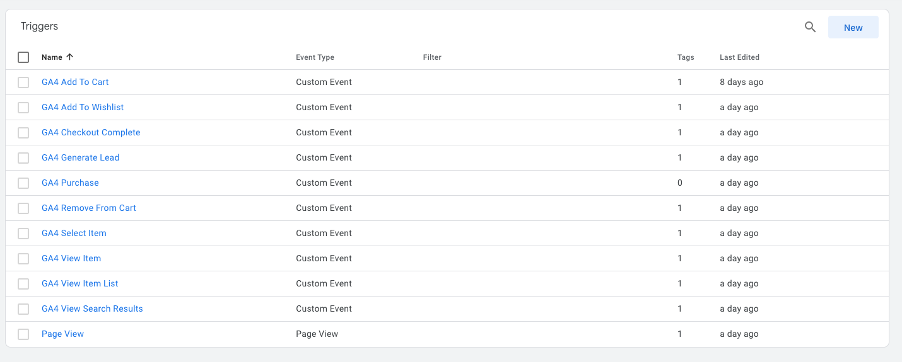
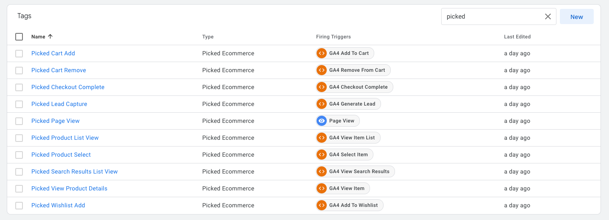
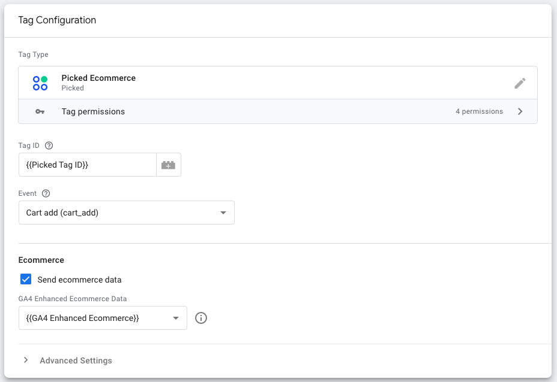

# Picked Ecommerce GTM Tag Template

[Picked](https://www.picked.app/) is an AI-powered conversion rate optimization (CRO) tool designed to help eCommerce
businesses get their brand and products *picked* more often by customers.

## Installation

To install the Picked Ecommerce GTM Tag Template, follow these steps:

1. From within Tag Manager, click **Templates**.
2. In the **Tag Templates** section, click **Search Gallery**.
3. Open the search field and enter `Picked Ecommerce`.
4. Click the Picked Ecommerce template to view the template details.
5. To add the template, click **Add to workspace**.
6. Review the required template permissions and click **Add**.

## Setup

1. Grab your project Tag ID by signing in to the [Picked Dashboard](https://dashboard.picked.app) and save it as a
   variable in GTM (e.g. `Picked Tag ID`).

2. Create an additional variable for the GA4 Enhanced Ecommerce data. The variable type should be `Data Layer Variable`
   and the data layer variable name should be `ecommerce`.

3. To track GA4 Ecommerce events ensure you have created a Trigger for each event you want to track.

4. Create a new tag for each event you want to track and select the Picked Ecommerce Tag Template. See **Configuration
   Options** below for more details.

## Configuration Options

- **Tag ID**: The Picked Tag ID for your project. This can be found in
  the [Picked Dashboard](https://dashboard.picked.app).
- **Event**: The name of the event you want to track.
- **Send ecommerce data**: If enabled, the tag will send the ecommerce data to Picked.
  This should be enabled for all
  ecommerce events.
- **GA4 Enhanced Ecommerce Data**: The GA4 Enhanced Ecommerce data to send to Picked.

## Feedback

Feel free to [open an issue](https://github.com/picked-app/gtm-template/issues) if you have any questions or feedback.
